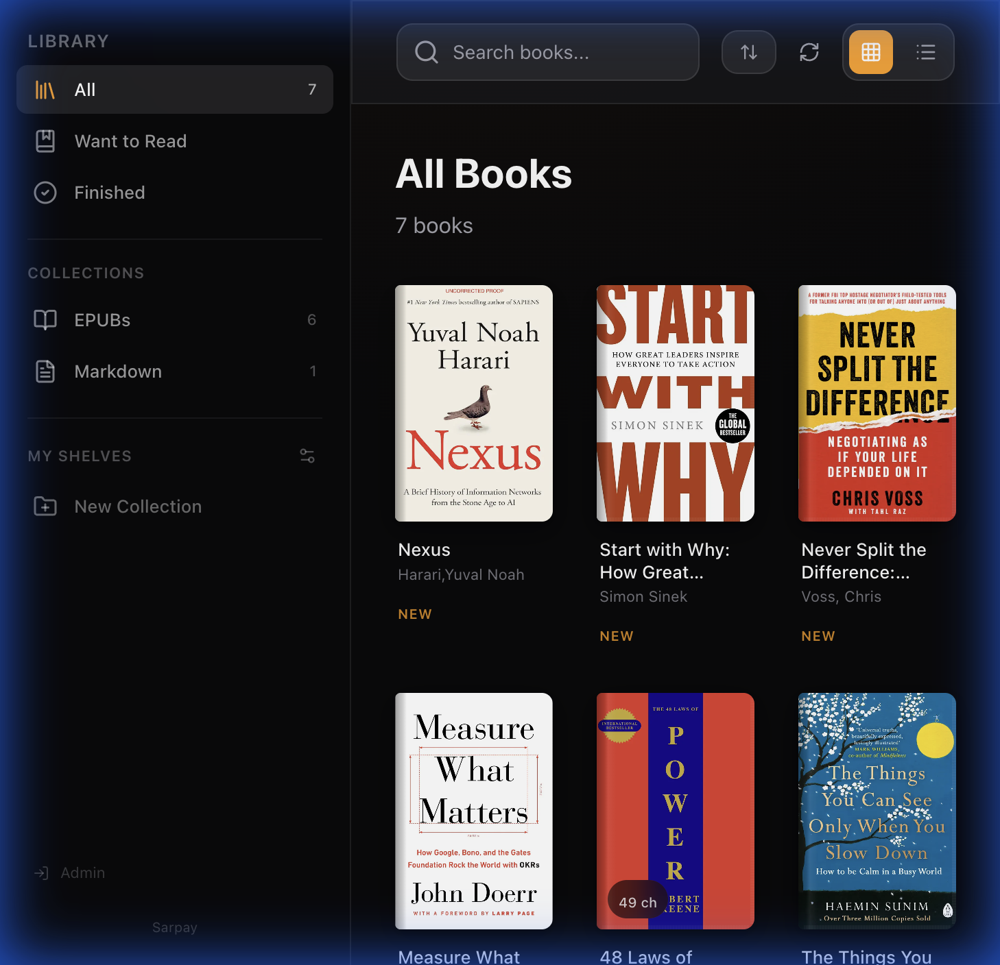

<p align="center">
  
</p>

<h1 align="center">📚 Sarpay</h1>

<p align="center">
  A premium, Apple Books-inspired digital library &amp; reader — built with Next.js, React, and Supabase.
</p>

<p align="center">
  <a href="https://sarpayapp.vercel.app">Live Demo</a> · <a href="#-quick-start">Quick Start</a> · <a href="#-features">Features</a>
</p>

<p align="center">
  
  
  
  
  
  
</p>

---

## ✨ Features

**Multi-Format Reader** — Read EPUB and Markdown books with a polished, distraction-free experience.

**Apple Books-Style UI** — Dark glassmorphism sidebar, smooth Framer Motion animations, and premium typography.

**Library Management** — Grid/list views, search, sort, filter by collection (EPUB / Markdown), custom shelves.

**Reading Themes** — Original (white), Quiet (grey), Paper (sepia), Focus (dark) — plus adjustable font, size, weight, line height, and brightness.

**Myanmar Language Support** — Built-in Pyidaungsu and Noto Sans Myanmar fonts for Burmese readers.

**Progress Sync** — Reading progress is automatically saved to Supabase and synced across sessions.

**Admin Controls** — Upload, edit, and delete books behind an email-gated admin role.

**Immersive Mode** — Fullscreen reading with auto-hiding UI, keyboard navigation (← →), and swipe support.

<p align="center">
  
</p>

---

## 🛠 Tech Stack

| Layer | Technology |
|---|---|
| Framework | [Next.js 16](https://nextjs.org) (App Router) |
| UI | [React 19](https://react.dev) + [Tailwind CSS 4](https://tailwindcss.com) |
| Language | TypeScript 5 |
| Animations | [Framer Motion 12](https://www.framer.com/motion/) |
| EPUB Engine | [epub.js](https://github.com/futurepress/epub.js) |
| Markdown | [react-markdown](https://github.com/remarkjs/react-markdown) |
| Backend | [Supabase](https://supabase.com) (PostgreSQL + Storage) |
| Icons | [Lucide React](https://lucide.dev) |
| Testing | [Vitest](https://vitest.dev) + Testing Library |
| Hosting | [Vercel](https://vercel.com) |

---

## 🚀 Quick Start

### Prerequisites

- Node.js 18+
- A [Supabase](https://supabase.com) project

### 1. Clone & install

```bash
git clone https://github.com/MawGyi/sarpay.git
cd sarpay
npm install
```

### 2. Configure environment

```bash
cp .env.local.example .env.local
```

Fill in your Supabase credentials and admin email:

```env
NEXT_PUBLIC_SUPABASE_URL=https://your-project.supabase.co
NEXT_PUBLIC_SUPABASE_ANON_KEY=your-anon-key
NEXT_PUBLIC_ADMIN_EMAIL=you@example.com
```

### 3. Set up the database

Run these SQL statements in the Supabase SQL Editor:

<details>
<summary><strong>📋 Click to expand SQL migrations</strong></summary>

**Books table**
```sql
create table books (
  id uuid default gen_random_uuid() primary key,
  user_id uuid references auth.users(id),
  title text not null,
  author text not null default 'Unknown',
  description text,
  file_url text not null,
  cover_url text,
  format_type text not null check (format_type in ('epub', 'md', 'pdf')),
  file_size bigint,
  created_at timestamptz default now() not null,
  updated_at timestamptz default now() not null
);
```

**Chapters table**
```sql
create table chapters (
  id uuid default gen_random_uuid() primary key,
  book_id uuid references books(id) on delete cascade not null,
  title text not null,
  file_url text not null,
  file_path text,
  order_index integer default 0,
  created_at timestamptz default now() not null
);

create index idx_chapters_book_id on chapters(book_id);
```

**Reading progress table**
```sql
create table user_progress (
  id uuid default gen_random_uuid() primary key,
  user_id uuid references auth.users(id),
  book_id uuid references books(id) on delete cascade not null,
  location text not null,
  percentage integer default 0,
  current_location integer,
  total_locations integer,
  updated_at timestamptz default now() not null,
  unique(user_id, book_id)
);
```

**Row Level Security (recommended)**
```sql
alter table books enable row level security;
alter table chapters enable row level security;
alter table user_progress enable row level security;

create policy "Public read access" on books for select using (true);
create policy "Public read access" on chapters for select using (true);
```

**Storage bucket**
```sql
insert into storage.buckets (id, name, public)
values ('books', 'books', true);
```

</details>

### 4. Run

```bash
npm run dev
```

Open [localhost:3000](http://localhost:3000) — you're all set.

---

## 📁 Project Structure

```
src/
├── app/                     # Next.js App Router
│   ├── page.tsx             # Library home
│   ├── admin/login/         # Admin login
│   ├── book/[id]/           # Book detail
│   └── reader/[id]/         # Reader
├── components/
│   ├── library/             # BookCard, LibraryGrid, modals
│   ├── reader/              # EpubReader, MdReader, ReaderSettings
│   └── upload/              # UploadModal
├── contexts/                # AuthContext (admin gating)
├── hooks/                   # useLocalStorage, useReadingProgressSync, useImmersiveMode
├── lib/
│   ├── api/                 # Book CRUD + Supabase queries
│   └── supabase.ts          # Client init
├── middleware.ts             # Auth middleware
└── types/                   # TypeScript types
```

---

## 📜 Scripts

| Command | Description |
|---|---|
| `npm run dev` | Start dev server |
| `npm run build` | Production build |
| `npm run start` | Serve production build |
| `npm run lint` | Run ESLint |
| `npm test` | Run tests (Vitest, watch mode) |
| `npm run test:run` | Run tests once |
| `npm run test:coverage` | Run tests with coverage |

---

## 🌐 Deployment

The app is deployed on **Vercel** with automatic deploys on push to `main`.

**Live:** [sarpayapp.vercel.app](https://sarpayapp.vercel.app)

Make sure to set these environment variables in your Vercel project settings:

- `NEXT_PUBLIC_SUPABASE_URL`
- `NEXT_PUBLIC_SUPABASE_ANON_KEY`
- `NEXT_PUBLIC_ADMIN_EMAIL`

---

## 🤝 Contributing

1. Fork the repo
2. Create a feature branch (`git checkout -b feature/your-feature`)
3. Commit your changes (`git commit -m 'Add your feature'`)
4. Push to the branch (`git push origin feature/your-feature`)
5. Open a Pull Request

---

## 📄 License

MIT — see [LICENSE](LICENSE) for details.

---

## 🙏 Acknowledgments

- [epub.js](https://github.com/futurepress/epub.js) — EPUB rendering
- [Supabase](https://supabase.com) — Backend as a Service
- [Framer Motion](https://www.framer.com/motion/) — Animations
- [Lucide](https://lucide.dev) — Icons
- [Apple Books](https://www.apple.com/apple-books/) — Design inspiration

---

<p align="center">
  Built with ❤️ for book lovers<br/>
  <strong>Sarpay</strong> · စာပေ
</p>
